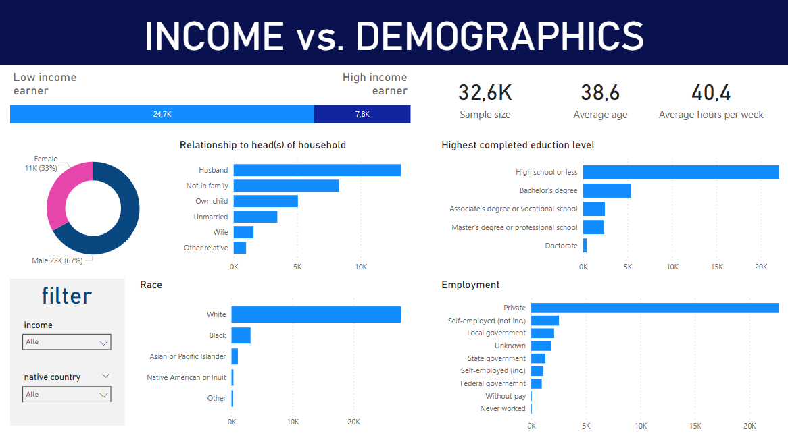

# Exploratory Data Analysis of the Income in US Households Using Python

## Introduction
This dataset contains 32,561 rows and 15 columns. Each row represents a subset of a population. The columns contain socio-economic data. The data set can be found on [Kaggle](https://www.kaggle.com/datasets/lodetomasi1995/income-classification/).

We are interested in the relationship between various socio-economic factors on the income. Income is represented by two classes: The class that earn 50,000 a year or less and the class earning more than 50,000 a year. In the [first part](https://github.com/manalelabdellaoui/income_evaluation_eda/blob/main/preprocessing.ipynb) of this project, we checked the data for duplicates, missing values, typos and other inconsistencies and corrected them where possible. In the [second part](https://github.com/manalelabdellaoui/income_evaluation_eda/blob/main/exploratory_data_analysis.ipynb), we went through all the socio-economic information and visualized and analyzed their direct relationship with the income as well as the combined effects of factors on income.

Note that this project has been conducted with the aim to use the findings in a future project where a classification model will be trained to predict the income class using the socio-economic data. Once that project is finished, it will be linked here.

## Dataset
The dataset contain both qualitative and quantitative features. As mentioned before, the target variable, `income`, is a binary feature.

Quantitative features:
- `fnlwgt`: final sample weight, an indicator of how many people in the population are represented by this particular observation in the dataset;
- `age`: age in years;
- `capital_gain`: capital gain in a year;
- `capital_loss`: capital loss in a year;
- `hours_per_week`: number of work hours per week.

Qualitative features:
- `workclass`: type of employment (such as private, public, self employed etc.);
- `education`: highest education level (16 specified levels in total);
- `education_num`: the 16 categories of education converted into numerical categories 1-16;
- `marital_status`: marital status (such as married, divorced, widowed etc.);
- `occupation`: occupation (such as tech support, craft/repair, sales etc.)
- `relationship`: relationship to the head(s) of the household (such as wife, husband, child, other relative etc.);
- `race`: Native American/Inuit, Asian/Pacific Islander, black, white or other.
- `sex`: male or female;
- `native_country`: country of origin.

In part 2 of this project, a few quantitative features have been added:
- `education_compact`: education levels aggregated into 7 broader categories (no degree, high school or GED, associate's, bachelor's, master's, professional school, doctorate);
- `education_compact_num`: the 7 categories of education converted into numerical categories 1-7;
- `us`: 1 if individual is from the US, 0 otherwise;
- `married`: 1 is individual is married, 0 otherwise.

## Dashboard
I've created a simple and concise interactive dashboard for a quick overview of the data we were working with. It's created with Power BI and can be downloaded [here](https://github.com/manalelabdellaoui/income-evaluation-eda/blob/main/dashboard.pbix).

## Findings
Since `fnlwgt` seems to have no effect on income, this will be the only feature that is completely excluded from further analysis. The other quantitative features did show distinct patterns between the lower and higher income class.

Men make up a significantly larger portion of the higher income class. The lower income class has a more similar gender distribution to the overall sample, which is larger than the higher income class. Only 11% of women belong to the higher income class, while 31% of men are in that class. The female sample is also notably younger, which may explain the income disparities. Most individuals in the lower income class have not pursued education beyond high school, while the higher income class has more individuals with higher degrees. Despite the younger age of women, the proportion of people with a master's degree or higher is similar across both genders.

A majority of both income classes is white, with larger shares of Black and Asian/Pacific Islander populations in the lower income class. The 'Other' category is three times larger in the lower income class. A new `us` column is created to distinguish US residents (89.6% of the sample). Significant differences in immigrant background are seen in countries like Mexico, the Philippines, and others, correlating with income class. Most people work in the private sector, but relatively more higher-income earners work in government or are self-employed, especially with incorporated businesses. Physical jobs are more common in the lower income class, while jobs requiring education or experience are more common in the higher income class.

The `relationship` feature indicates a person’s role in their household, such as wife, husband, or living with a parent. Married people are more likely to be in the higher income class, which is expected as they often have more stability and share household responsibilities. A new binary column has been created to label people as married or unmarried based on their living situation, simplifying the data for future analysis.
